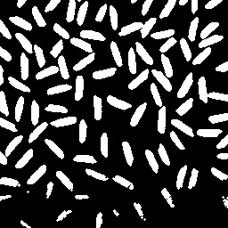
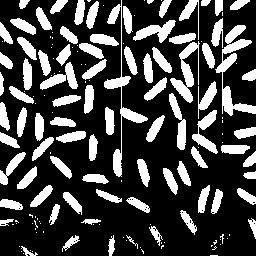

# Image-Engineering-Course-Project

- [Image-Engineering-Course-Project](#image-engineering-course-project)
  - [1. Experiment purpose](#1-experiment-purpose)
  - [2.  Experiment environment](#2--experiment-environment)
  - [3.Experiment content](#3experiment-content)
    - [3.1](#31)
      - [3.1.1 Experiment requirements](#311-experiment-requirements)
      - [3.1.2 Experiment design](#312-experiment-design)
      - [3.1.3  Algorithm Implementation](#313--algorithm-implementation)
      - [3.1.4  Analysis of results](#314--analysis-of-results)
    - [3.2](#32)
      - [3.2.1 Experiment requirements](#321-experiment-requirements)
      - [3.2.2 Experiment design](#322-experiment-design)
      - [3.2.3 Algorithm Implementation](#323-algorithm-implementation)
      - [3.2.4 Analysis of results](#324-analysis-of-results)
    - [3.3](#33)
      - [3.3.1 Experimental requirements](#331-experimental-requirements)
      - [3.3.2  Experimental design](#332--experimental-design)
        - [3.3.2.1 Motion target detection](#3321-motion-target-detection)
        - [3.3.2.2 Multi-target tracking](#3322-multi-target-tracking)
      - [3.3.3 Algorithm Implementation](#333-algorithm-implementation)
        - [3.3.3.1  Motion Target Detection](#3331--motion-target-detection)
        - [3.3.3.2 Multi-target tracking](#3332-multi-target-tracking)
      - [3.3.4 Analysis of results](#334-analysis-of-results)
        - [3.3.4.1  Motion target detection](#3341--motion-target-detection)
      - [3.4.2 Multi-target tracking](#342-multi-target-tracking)
  - [4    Experimental conclusion](#4----experimental-conclusion)
  - [5    Appendix](#5----appendix)
    - [Appendix A: area pixel size](#appendix-a-area-pixel-size)

## 1. Experiment purpose

1. To learn the OpenCV library of Python and understand the principles and basic operations of image processing；

2. To learn and use algorithms for image processing (e.g., Otsu algorithm) to solve practical problems；

3. To implement target detection and trajectory tracking of images; to compare and analyze the effectiveness and applicability of different algorithms.

## 2.  Experiment environment

1. Anaconda;

2. OpenCV; 

3. Visual Studio Code. 

## 3.Experiment content

### 3.1

#### 3.1.1 Experiment requirements

1. In the development environment, select a representative image;

2. Display the corresponding B, G and R channels;

3. Convert the original image into HSV space representation and display the corresponding components;

4. Analyze the RGB and HSV component display images separately;

5. (Optional) Use pyplot in matplotlib, apply the plot function to display the image to see if it can be displayed properly, and further use this function to divide the image into 2*4 sub-windows to display the original image and different components in different sub-windows.

#### 3.1.2 Experiment design


#### 3.1.3  Algorithm Implementation

```python
1.	import cv2 as cv
2.	import matplotlib.pyplot as plt
3.	
4.	filename = r'/Users/loujieming/Downloads/season.JPG'
5.	img = cv.imread(filename)
6.	
7.	#转化颜色空间
8.	gray = cv.cvtColor(img, cv.COLOR_BGR2GRAY)
9.	hsv = cv.cvtColor(img, cv.COLOR_BGR2HSV)
10.	
11.	# 绘制子图，由于cv读入图片信息为BGR信息，使用plt时需要转换
12.	plt.figure()
13.	plt.subplot(2,4,1)
14.	plt.imshow(img[:, :, [2, 1, 0]]) # 转化成RGB
15.	plt.title("img")
16.	plt.subplot(2,4,2)
17.	plt.imshow(img[:, :, [2, 1, 0]][:, :, 0])
18.	plt.title("Blue")
19.	plt.subplot(2,4,3)
20.	plt.imshow(img[:, :, [2, 1, 0]][:, :, 1])
21.	plt.title("Green")
22.	plt.subplot(2,4,4)
23.	plt.imshow(img[:, :, [2, 1, 0]][:, :, 2])
24.	plt.title("Red")
25.	
26.	plt.subplot(2,4,5)
27.	plt.imshow(hsv)
28.	plt.title("hsv")
29.	plt.subplot(2,4,6)
30.	plt.imshow(hsv[:, :, [2, 1, 0]][:, :, 0])
31.	plt.title("Hue")
32.	plt.subplot(2,4,7)
33.	plt.imshow(hsv[:, :, [2, 1, 0]][:, :, 1])
34.	plt.title("Saturation")
35.	plt.subplot(2,4,8)
36.	plt.imshow(hsv[:, :, [2, 1, 0]][:, :, 2])
37.	plt.title("Value")
38.	
39.	plt.show()
40.	
41.	# 使用cv2显示图片
42.	cv.imshow('source image', img)
43.	cv.imshow('gray', gray)
44.	cv.waitKey()
45.	
46.	cv.imshow("Hue", hsv[:, :, 0])
47.	cv.imshow("Saturation", hsv[:, :, 1])
48.	cv.imshow("Value", hsv[:, :, 2])
49.	cv.waitKey()
50.	
51.	cv.imshow("Blue", img[:, :, 0])
52.	cv.imshow("Green", img[:, :, 1])
53.	cv.imshow("Red", img[:, :, 2])
54.	
55.	cv.waitKey()
56.	cv.destroyAllWindows()
```

 

#### 3.1.4  Analysis of results

|  |  |  |  |
| :----------------------------------------------------------: | :----------------------------------------------------------: | :----------------------------------------------------------: | :----------------------------------------------------------: |
|  |  |  |  |


Use `cv.imshow` to plot a graph, the first line from left to right is the original image/Blue/Green/Red channel, the second line from left to right is the hsv image/Hue/Saturation/Value channel.


Use `plt.imshow` to plot a graph.

This experiment mainly uses two color spaces, RGB and HSV.

The RGB space consists of three channels representing an image: red (R), green (G) and blue (B). Different combinations of these three colors can form almost all other colors, and thus this representation is well suited for the display of images. Intuitively, in a single RGB channel image, the shade is related to the color value of this pixel.

Compared with the RGB space, the HSV color space is more closer to people's perceptual experience of colors. It is very intuitive in expressing the hue, vividness and lightness of colors, and facilitates the comparison among colors. Intuitively, in a single HSV channel image, the shade is related to the hue, saturation, and brightness of this pixel.

 

The comparison shows a number of differences between cv and matplotlib in the processing and display of images.

1. When reading in, `cv.imread` reads in BGR mode while `plt.imread`reads in RGB mode. The two have different channel sequences. When drawing images using plt and cv, after the channel order is swapped, you can see that the images drawn are identical.

2. When displaying images of separate channels, `cv.imshow` defaults to black and white, while `plt.imshow` defaults to yellow and green.

 

### 3.2 

#### 3.2.1 Experiment requirements

1. In the development environment, display the grayscale histogram of the rice grain image;
2. Use Otsu or other methods to perform threshold segmentation and get the binarization result after segmentation;
3. Apply the `findContours` function to the result and get the contours of all the rice grains;
4.  Draw the minimum enclosing rectangle for each rice grain, further calculate the variance and perform statistics;
5.  Analyze the segmentation and statistical results. 

#### 3.2.2 Experiment design


 

#### 3.2.3 Algorithm Implementation

```python
1	import cv2 as cv
2	import copy
3	import matplotlib.pyplot as plt
4	import numpy as np
5	
6	def contrast_brightness_image(src1, a, g):
7	    h, w, ch = src1.shape#获取shape的数值，height和width、通道
8	 
9	    #新建全零图片数组src2,将height和width，类型设置为原图片的通道类型(色素全为零，输出为全黑图片)
10	    src2 = np.zeros([h, w, ch], src1.dtype)
11	    dst = cv.addWeighted(src1, a, src2, 1-a, g)#addWeighted函数说明如下
12	    cv.imshow("con-bri-demo", dst)
13	    return dst
14	
15	# 打开图像
16	filename = r'/Users/loujieming/Downloads/rice.JPG'
17	image = cv.imread(filename)
18	gray = cv.cvtColor(image, cv.COLOR_BGR2GRAY)
19	
20	# 修改图像对比度
21	
22	# 大津算法灰度阈值化
23	# thr, bw = cv.threshold(gray,129,200,cv.THRESH_BINARY)
24	thr, bw = cv.threshold(gray, 0, 0xff, cv.THRESH_OTSU)
25	print('Threshold is :', thr)
26	
27	# 画出灰度直方图
28	plt.hist(gray.ravel(), 256, [0, 256])
29	plt.show()
30	
31	element = cv.getStructuringElement(cv.MORPH_CROSS, (3, 3))
32	bw = cv.morphologyEx(bw, cv.MORPH_OPEN, element)
33	
34	seg = copy.deepcopy(bw)
35	# 计算轮廓
36	cnts, hier = cv.findContours(seg, cv.RETR_EXTERNAL, cv.CHAIN_APPROX_SIMPLE)
37	minarea = 5000
38	maxarea = 0
39	meanarea = 0
40	count = 0
41	# 遍历所有区域，并去除面积过小的
42	for i in range(len(cnts), 0, -1):
43	    c = cnts[i-1]
44	    area = cv.contourArea(c)
45	    maxarea = max(maxarea,area)
46	    minarea = min(minarea,area)
47	    meanarea += area
48	    if area < 10:
49	        continue
50	    count = count + 1
51	    print("blob", i, " : ", area)
52	
53	    # 区域画框并标记
54	    x, y, w, h = cv.boundingRect(c)
55	    cv.rectangle(image, (x, y), (x+w, y+h), (0, 0, 0xff), 1)
56	    cv.putText(image, str(count), (x, y), cv.FONT_HERSHEY_PLAIN, 0.5, (0, 0xff, 0))
57	
58	meanarea /= len(cnts)
59	print("米粒数量： ", count)
60	print("maxarea=" + str(maxarea))
61	print("minarea=" + str(minarea))
62	print("meanarea=" + str(meanarea))
63	
64	cv.startWindowThread()
65	
66	cv.imshow("源图", image)
67	cv.imwrite("源图.jpg",image)
68	cv.waitKey()
69	cv.imshow("阈值化图", bw)
70	cv.imwrite("阈值化图.jpg",bw)
71	cv.waitKey()
72	cv.destroyAllWindows()
```

 

#### 3.2.4 Analysis of results


Gray histogram of rice image

|  |  |
| :----------------------------------------------------------: | :----------------------------------------------------------: |
|                         Source graph                         |                      Thresholding graph                      |

Statistics of rice grain results：

| Max area  | 383.5   |
| --------- | ------- |
| Min area  | 2.0     |
| Mean area | 146.397 |
| Threshold | 129.0   |
| 米粒数量  | 93      |

The detailed results of the filtered region segmentation pixel statistics are shown in Appendix A.

Observation of the grayscale histogram reveals that there are significant differences in grayscale between the target and background regions, or between different target regions. Observing the image, we can see that the Otsu algorithm divides the image into two parts, background and foreground, based on the grayscale characteristics of the image. On the source map, the background part is framed with a closed red line square and labeled sequentially, in total of 93 rice grains (the accuracy is high). The background was also clearly marked in the thresholding map. The variance was further calculated to be 35.67. The number of rice grains falling within the 2.5σ range was 30.

However, it was found that there were still some rice grains that were not marked on the rice grain map. I first tried to adjust the contrast reading and brightness of the rice grain image, but failed to improve the labeling success rate; then I adjusted the threshold using the method of `cv.THRESH_BINARY`, but still found that a threshold of 129 was the best result. This is because OpenCV's Otsu algorithm is based on a global threshold segmentation algorithm, which is highly susceptible to the interference of uneven lighting. As a result, the image foreground pixels and background pixels are segmented unreasonably, which leads to the failure of distinguishing the darker rice grains for the rice grain map. A better approach is to implement a local Otsu algorithm. However, OpenCV does not have a function to package a good local Otsu algorithm. The following is a Python implementation of the local Otsu algorithm. The main idea is to use a local threshold segmentation method, where each column is localized, and each column is subjected to the Otsu algorithm once to find the column threshold and so on, until all columns are traversed. The code implementation is as follows.

```python
1.	import cv2 as cv
2.	import numpy as np

3.	# 转灰
4.	def rgb2gray(img):
5.	     h=img.shape[0]
6.	     w=img.shape[1]
7.	     img1=np.zeros((h,w),np.uint8)
8.	     for i in range(h):
9.	          for j in range(w):
10.	               img1[i,j]=0.144*img[i,j,0]+0.587*img[i,j,1]+0.299*img[i,j,1]
11.	     return img
12.	
13.	# 局部大津算法实现
14.	def otsu(img):
15.	     h=img.shape[0]
16.	     w=img.shape[1] 
17.	     otsuimg=np.zeros((h,w),np.uint8)
18.	     for i in range(w):   # 遍历列
19.	 		sigma=threshold=0   # 定义类间方差和最终阈值
20.	         histogram=np.zeros(256,np.int32)   # 初始化各灰度级个数统计
21.	 	    probability=np.zeros(256,np.float32)   # 初始化各灰度级概率分布
22.	        for j in range (h):   # 遍历行，进行otsu算法
23.	  		   s=img[j,i]
24.	            histogram[s]+=1   # 统计灰度级中每个像素在整幅图像中的个数
25.	        for k in range (256):
26.	             probability[k]=histogram[k]/h   # 统计每个灰度级占图像中的分布
27.	        for p in range (255):
28.	             w0 = w1 = 0   # 定义前景像素点和背景像素点灰度级占图像中的分布
29.	             fgs = bgs = 0   # 定义前景像素点灰度级总和and背景像素点灰度级总和
30.	             for q in range (256):
31.	                  if q<=p:   # 当前i为分割阈值
32.	                      w0+=probability[q]   # 前景像素点占整幅图像的比例累加
33.	                      fgs+=q*probability[q]   # 前景像素点的平均灰度
34.	                  else:
35.	                      w1+=probability[q]   # 背景像素点占整幅图像的比例累加
36.	                      bgs+=q*probability[q]   # 背景像素点的平均灰度
37.	                  u0=fgs/w0
38.	                  u1=bgs/w1
39.	                  g=w0*w1*(u0-u1)**2   # 类间方差
40.	                  if g>=sigma:
41.	 				   sigma=g
42.	 				   threshold=p
43.	             for j in range (h):   # 对某列的每一行进行二值化
44.	                  if img[j,i]>threshold:
45.	                  otsuimg[j,i]=255
46.	             else:
47.	                  otsuimg[j,i]=0
48.	       return otsuimg
```

 

The edge results obtained by the local Otsu method are following.

|  |  |
| :------------------------------------------------: | :------------------------------------------------: |
|   Threshold graph obtained by global Otsu method   |   Threshold graph obtained by local Otsu method    |

It can be seen that some rice grains with lower brightness are also recognized. If we want to achieve an even better recognition, we need to perform finer-grained segmentation and perform Otsu method on small areas.


### 3.3 

#### 3.3.1 Experimental requirements

1. System input: the given video (with the target); System output: the detected target frame and the target motion trajectory;

2. The experiment was first conducted on the "viplane" video and then conducted on the "Cap02t3", "999" and " video1" video.

   

#### 3.3.2  Experimental design

##### 3.3.2.1 Motion target detection

A background extraction algorithm is used by selecting a picture as the background and then compare it with every frame.


##### 3.3.2.2 Multi-target tracking

**（1）Multi-target tracking using optical flow method (automatic target selection for tracking)**

The optical flow method is a very common method for marking the trajectories of moving objects in video, and it is easy to implement optical flow in OpenCV. Optical flow expresses changes in the image and can be used by the observer to determine the motion of a target since it contains information about the target's motion. `cv2.calcOpticalFlowPyrLK` function computes the optical flow of a sparse feature set using the iterative Lucas-Kanade method in the pyramid.

Implementation principle：

First the first frame is selected, the Shi-Tomasi corner points are detected in the first image frame, and then the LK algorithm is used to iteratively track these feature points. The iteration is done by continuously passing the feature points of the previous frame and the current frame into `cv2.calcOpticalFlowPyrLK`. The function returns the points of the current frame with the status 1 or 0. If a point from the previous frame is found in the current frame, then the status of the point is 1, otherwise it is 0.

Implementation flow:

1. Load the video;

2. Call the `GoodFeaturesToTrack` function to find points of interest (keypoints);

3. Call the `CalcOpticalFlowPyrLK` function to calculate the movement of the points of interest in the two frames of the image.

4. Delete the unmoved points of interest;

5. Draw a line segment between the two moving points.

 

**（2）Multi-target tracking using KCF algorithm (can track specified multiple targets)**

Kernel Correlation Filter (KCF), i.e., the kernel correlation filter algorithm, uses a circular matrix of the region around the target to collect positive and negative samples, uses ridge regression to train the target detector, and successfully uses the diagonalizable nature of the circular matrix in Fourier space to transform the operation of the matrix into the Hadamad product of vectors, i.e., the dot product of elements. This greatly reduces the amount of operations and increases the speed of operations, allowing the algorithm to meet real-time requirements. The ridge regression in linear space is mapped to nonlinear space by kernel functions, and the same can be simplified by solving a pairwise problem and certain common constraints in nonlinear space using circular matrix Fourier space diagonalization. A way to incorporate multichannel data into this algorithm is given.

This is achieved by directly creating a KCF algorithm tracker using the `TrackerKCF_create()` function in the OpenCV library.

 

#### 3.3.3 Algorithm Implementation

##### 3.3.3.1  Motion Target Detection

```python
1.	import cv2
2.	import numpy as np

3.	cap = cv2.VideoCapture('/Users/loujieming/小铭不熬夜/作业和笔记/图像工程/图片视频/999.mp4')

4.	#测试用,查看视频size
5.	size = (int(cap.get(cv2.CAP_PROP_FRAME_WIDTH)),
6.	         int(cap.get(cv2.CAP_PROP_FRAME_HEIGHT)))
7.	print('size:'+repr(size))
8.	
9.	# 构建椭圆结果
10.	es = cv2.getStructuringElement(cv2.MORPH_ELLIPSE, (9, 4))
11.	kernel = np.ones((5, 5), np.uint8)
12.	background = None
13.	
14.	while True:
15.	 	# 读取视频流
16.	 	grabbed, frame = cap.read()
17.	
18.	 	if frame is None:
19.	 		Break
20.	
21.	 	# 对帧进行预处理，>>转灰度图>>高斯滤波（降噪：摄像头震动、光照变化）。
22.	 	gray_lwpCV = cv2.cvtColor(frame, cv2.COLOR_BGR2GRAY)
23.	 	gray_lwpCV = cv2.GaussianBlur(gray_lwpCV, (21, 21), 0)
24.	 
25.	 	if background is None:
26.	 		background = gray_lwpCV
27.	 		Continue
28.	
29.	 	# 对比背景之后的帧与背景之间的差异，并得到一个差分图（different map）。
30.	 	# 阈值（二值化处理）>>膨胀（dilate）得到图像区域块
31.	 	diff = cv2.absdiff(background, gray_lwpCV)
32.	 	diff = cv2.threshold(diff, 25, 255, cv2.THRESH_BINARY)[1]
33.	 	diff = cv2.dilate(diff, es, iterations=2)
34.	
35.	 	_, fgmask = cv2.threshold(diff.copy(), 0, 0xff, cv2.THRESH_BINARY)
36.	
37.	 	# 显示矩形框：计算一幅图像中目标的轮廓
38.	 	cnts, hier  = cv2.findContours(fgmask.copy(), cv2.RETR_EXTERNAL,
39.	 	cv2.CHAIN_APPROX_SIMPLE)
40.	
41.	 	# 遍历所有区域，并去除面积过小的
42.	 	for i in range(len(cnts), 0, -1):
43.	 	c = cnts[i-1]
44.	 	area = cv2.contourArea(c)
45.	 	if area < 600:
46.	 		Continue
47.	
48.	 	# 区域画框并标记
49.	 	x, y, w, h = cv2.boundingRect(c)
50.	 	frame = cv2.rectangle(frame, (x, y), (x+w, y+h), (0, 255, 0), 2)
51.	
52.	 	cv2.imshow('contours', frame)
53.	 	# cv2.imshow('dis', diff)
54.	
55.	 	key = cv2.waitKey(100) & 0xFF
56.	 	if key == ord('q'):    # 按'q'健退出循环
57.	 		break
58.	# 释放资源并关闭窗口
59.	cap.release()
60.	cv2.destroyAllWindows()
```

 

##### 3.3.3.2 Multi-target tracking

**（1）Multi-target tracking using optical flow method** 

```python
1.	import numpy as np
2.	import cv2 as cv
3.	
4.	cap = cv.VideoCapture('/Users/loujieming/小铭不熬夜/作业和笔记/图像工程/图片视频
5.	/viplane.avi')
6.	
7.	# ShiTomasi corner detection的参数
8.	feature_params = dict(maxCorners=100,
9.	 					qualityLevel=0.3,
10.	 					minDistance=7,
11.	 					blockSize=7)
12.	# 光流法参数
13.	# maxLevel 未使用的图像金字塔层数
14.	lk_params = dict(winSize=(15, 15),
15.	 				maxLevel=2,
16.	 				criteria=(cv.TERM_CRITERIA_EPS | cv.TERM_CRITERIA_COUNT, 10, 0.03))
17.	
18.	# 创建随机生成的颜色
19.	color = np.random.randint(0, 255, (100, 3))
20.	
21.	ret, old_frame = cap.read()                             # 取出视频的第一帧
22.	old_gray = cv.cvtColor(old_frame, cv.COLOR_BGR2GRAY)  # 灰度化
23.	p0 = cv.goodFeaturesToTrack(old_gray, mask=None, **feature_params) # 获得旧的关注点
24.	mask = np.zeros_like(old_frame)                         # 为绘制创建掩码图
25.	
26.	while True:
27.	 	_, frame = cap.read()
28.	 	frame_gray = cv.cvtColor(frame, cv.COLOR_BGR2GRAY)
29.	
30.	 	# 计算光流以获取点的新位置
31.	 	p1, st, err = cv.calcOpticalFlowPyrLK(old_gray, frame_gray, p0, None, **lk_params)
32.	 	# 选择good points
33.	 	good_new = p1[st == 1]
34.	 	good_old = p0[st == 1]
35.	 	# 绘制跟踪框
36.	 	for i, (new, old) in enumerate(zip(good_new, good_old)):
37.	 		a, b = new.ravel()
38.	 		c, d = old.ravel()
39.	 		mask = cv.line(mask, (int(a), int(b)), (int(c), int(d)), color[i].tolist(), 1)
40.	 		frame = cv.circle(frame, (int(a), int(b)), 10, color[i].tolist())
41.	
42.	 	img = cv.add(frame, mask)
43.	 	cv.imshow('frame', img)
44.	
45.	 	k = cv.waitKey(100)  # & 0xff
46.	 	if k == 27:
47.	 		Break
48.	 	old_gray = frame_gray.copy()
49.	 	p0 = good_new.reshape(-1, 1, 2)
50.	
51.	cv.destroyAllWindows()
52.	cap.release()
```


**（2）Multi-target tracking using KCF algorithm**

```python
1.	import cv2
2.	import sys
3.	
4.	filename = '/Users/loujieming/小铭不熬夜/作业和笔记/图像工程/图片视频/Cap02t3.avi'
5.	video = cv2.VideoCapture(filename)
6.	
7.	ok, frame = video.read()
8.	if not ok:
9.	 	print('Cannot read video file')
10.	 	sys.exit()
11.	
12.	bbox = (287, 23, 86, 320)
13.	
14.	bbox1 = cv2.selectROI(frame, False)
15.	bbox2 = cv2.selectROI(frame, False)
16.	print(bbox1, bbox2)
17.	
18.	tracker1 = cv2.TrackerKCF_create()
19.	tracker2 = cv2.TrackerKCF_create()
20.	ok1 = tracker1.init(frame, bbox1)
21.	ok2 = tracker2.init(frame, bbox2)
22.	
23.	p31 = (int(bbox1[0] + bbox1[2]/2), int(bbox1[1] + bbox1[3]/2))
24.	p32 = (int(bbox2[0] + bbox2[2]/2), int(bbox2[1] + bbox2[3]/2))
25.	list1 = [p31]
26.	list2 = [p32]
27.	
28.	while True:
29.	 	# Read a new frame
30.	 	ok, frame = video.read()
31.	
32.	 	# Start timer
33.	 	timer = cv2.getTickCount()
34.	
35.	 	# Update tracker
36.	 	ok1, bbox1 = tracker1.update(frame)
37.	 	ok2, bbox2 = tracker2.update(frame)
38.	 	print(bbox1, bbox2)
39.	
40.	 	# Calculate Frames per second (FPS)
41.	 	fps = cv2.getTickFrequency() / (cv2.getTickCount() - timer)
42.	
43.	 	# Draw bounding box
44.	 	if ok1:
45.	 	# Tracking success
46.	 		p1 = (int(bbox1[0]), int(bbox1[1]))
47.	 		p2 = (int(bbox1[0] + bbox1[2]), int(bbox1[1] + bbox1[3]))
48.	 		p0 = (int(bbox1[0] + bbox1[2]/2), int(bbox1[1] + bbox1[3]/2))
49.	 		cv2.rectangle(frame, p1, p2, (255, 0, 0), 2, 1)
50.	 		list1.append(p0)
51.	 	     for i in range(len(list1)-1):
52.	              mask1 = cv2.line(mask1,list1[i],list1[i+1],(0,255,0),1)
53.	 	else:
54.	 	# Tracking failure
55.	 	cv2.putText(frame, "Tracking failure detected", (100, 80), cv2.FONT_HERSHEY_SIMPLEX, 
56.	 	0.75, (0, 0, 255), 2)
57.	
58.	 	if ok2:
59.	 	# Tracking success
60.	 		p1 = (int(bbox2[0]), int(bbox2[1]))
61.	 		p2 = (int(bbox2[0] + bbox2[2]), int(bbox2[1] + bbox2[3]))
62.	 		cv2.rectangle(frame, p1, p2, (255, 0, 0), 2, 1)
63.	 		p0 = (int(bbox1[0] + bbox1[2]/2), int(bbox1[1] + bbox1[3]/2))
64.	 		cv2.rectangle(frame, p1, p2, (255, 0, 0), 2, 1)
65.	 		list1.append(p0)
66.	 	     for i in range(len(list1)-1):
67.	              mask1 = cv2.line(mask1,list1[i],list1[i+1],(0,255,0),1)
68.	 	else:
69.	 	# Tracking failure
70.	 	cv2.putText(frame, "Tracking failure detected", (100, 80), cv2.FONT_HERSHEY_SIMPLEX,
71.	     0.75, (0, 0, 255), 2)
72.	
73.	 	# Display FPS on frame
74.	 	# cv2.putText(frame, "FPS : " + str(int(fps)), (100, 50), cv2.FONT_HERSHEY_SIMPLEX,
75.	 	0.75, (50, 170, 50), 2)
76.	
77.	 	# Display result
78.	 	cv2.imshow("Tracking", frame)
79.	
80.	 	# Exit if ESC pressed
81.	 	k = cv2.waitKey(100) & 0xff
82.	 	if k == 27: break
83.	 	elif k == ord("q"):
84.	 		Break
85.	
86.	video.release()
87.	cv2.destroyAllWindows()
```


#### 3.3.4 Analysis of results

##### 3.3.4.1  Motion target detection

**The screenshot results of the video are：**

|  |  |  |
| :----------------------------------------------------------: | :----------------------------------------------------------: | :----------------------------------------------------------: |
|                           999.mp4                            |                          video1.avi                          |                         Cap02t3.avi                          |

The video target detection based on the background extraction algorithm can detect the scenes where the background was not available before. However, the background selected at the beginning may cause errors with the change of lighting. This method is more suitable for places where the lighting conditions are stable. Moreover, this method can only detect the different points between frames and cannot achieve the tracking of specific targets.

 

#### 3.4.2 Multi-target tracking

**（1）Multi-target tracking using optical flow method**

|  |  |  |
| :----------------------------------------------------------: | ------------------------------------------------------------ | ------------------------------------------------------------ |
|                           999.mp4                            | viplane.avi                                                  | Cap02t3.avi                                                  |

It can be found that the optical flow method automatically detects the feature points with obvious motion and tracks the trajectories of multiple feature points at the same time, which is very effective. This method also achieves good detection of new feature points in the video. However, the optical flow method cannot track specific targets, and the feature points it detected are not always meaningful in practice.

 

**（2）Multi target tracking using KCF algorithm**

|  |  |  |
| :----------------------------------------------------------: | :----------------------------------------------------------: | :----------------------------------------------------------: |
|                           999.mp4                            |                         Cap02t3.avi                          |                         viplane.avi                          |

Here I used the mask and the tracker that comes with Opencv-contrib-python to achieve the simultaneous tracking of two specific targets and plot their movement trajectories. Overall it works well. The tracking of more targets can be done by adding more trackers in the code. When the target leaves the screen, "Tracking failure detected" will be displayed in the video, as shown in the figure.

Target leaves the screen in video1.avi：


## 4    Experimental conclusion

(1) Implemented the basic operations of image processing; understood the color space, displayed the corresponding B, G, and R channels, converted the original image into HSV space representation, and displayed the corresponding components; compared the differences of image display between pyplot and cv2 using matplotlib.

 

(2) Used and improved the global Otsu algorithm; plotted and analyzed the gray histogram of the rice grain image, and achieved the recognition and counting of the rice grains; plotted the minimum enclosing rectangle corresponding to the rice grains

 

(3) Used the background extraction algorithm, optical flow method and KCF algorithm for target detection and target trajectory tracking for different videos, respectively. Conducted a comparative analysis on the effect and applicability range, and made a series of improvements on the algorithm.

 

## 5    Appendix

### Appendix A: area pixel size

| blob       | 97    | 96    | 95    | 93    | 92    | 91    | 90    |
| :--------- | ----- | ----- | ----- | ----- | ----- | ----- | ----- |
| pixel size | 49    | 113.5 | 166   | 12    | 104.5 | 166.5 | 36    |
| blob       | 96    | 95    | 93    | 92    | 91    | 90    | 89    |
| pixel size | 113.5 | 166   | 12    | 104.5 | 166.5 | 36    | 76    |
| blob       | 95    | 93    | 92    | 91    | 90    | 89    | 88    |
| pixel size | 166   | 12    | 104.5 | 166.5 | 36    | 76    | 101   |
| blob       | 93    | 92    | 91    | 90    | 89    | 88    | 87    |
| pixel size | 12    | 104.5 | 166.5 | 36    | 76    | 101   | 178   |
| blob       | 92    | 91    | 90    | 89    | 88    | 87    | 86    |
| pixel size | 104.5 | 166.5 | 36    | 76    | 101   | 178   | 123   |
| blob       | 91    | 90    | 89    | 88    | 87    | 86    | 85    |
| pixel size | 166.5 | 36    | 76    | 101   | 178   | 123   | 160   |
| blob       | 90    | 89    | 88    | 87    | 86    | 85    | 84    |
| pixel size | 36    | 76    | 101   | 178   | 123   | 160   | 168.5 |
| blob       | 89    | 88    | 87    | 86    | 85    | 84    | 83    |
| pixel size | 76    | 101   | 178   | 123   | 160   | 168.5 | 193.5 |
| blob       | 88    | 87    | 86    | 85    | 84    | 83    | 82    |
| pixel size | 101   | 178   | 123   | 160   | 168.5 | 193.5 | 168   |
| blob       | 87    | 86    | 85    | 84    | 83    | 82    | 81    |
| pixel size | 178   | 123   | 160   | 168.5 | 193.5 | 168   | 383.5 |
| blob       | 86    | 85    | 84    | 83    | 82    | 81    | 80    |
| pixel size | 123   | 160   | 168.5 | 193.5 | 168   | 383.5 | 122   |
| blob       | 85    | 84    | 83    | 82    | 81    | 80    | 79    |
| pixel size | 160   | 168.5 | 193.5 | 168   | 383.5 | 122   | 356.5 |
| blob       | 84    | 83    | 82    | 81    | 80    | 79    | 78    |
| pixel size | 168.5 | 193.5 | 168   | 383.5 | 122   | 356.5 | 143.5 |

 

 